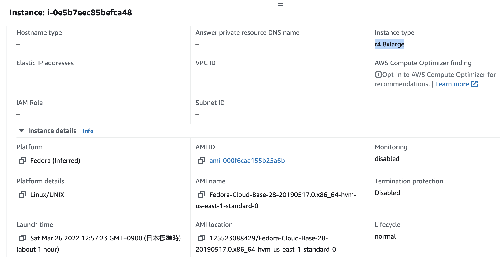

# aws-ec2-train-xgboost-model 🐳


[](https://github.com/tquangdo/aws-ec2-train-xgboost-model/issues/new)

## reference
[tiensu](https://tiensu.github.io/blog/14_train_xgboost_models_on_aws/)

## launch EC2
- step "AMI": input `Fedora-Cloud-Base`
- step "instance type": select `r4.8xlarge` (32 cores CPU)


## fedora os
- check os info
```shell
[fedora@ip-172-31-91-17 ~]$ cat /proc/cpuinfo | grep processor | wc -l # 32 (cores)
cat /proc/version
=>
Linux version 5.0.16-100.fc28.x86_64 (mockbuild@bkernel04.phx2.fedoraproject.org) (gcc version 8.3.1 20190223 (Red Hat 8.3.1-2) (GCC)) #1 SMP Tue May 14 18:22:28 UTC 2019
```
- install by `dnf`: `sudo dnf install wget`
- check installed version
```shell
gcc --version # gcc (GCC) 8.3.1 20190223 (Red Hat 8.3.1-2)
python3 --version # Python 3.6.8
python3 -c "import scipy;print(scipy.__version__)" && python3 -c "import numpy;print(numpy.__version__)"
# 1.0.0
# 1.14.5
python3 -c "import pandas;print(pandas.__version__)" && python3 -c "import sklearn;print(sklearn.__version__)"
# 0.22.0
# 0.19.1
cmake --version # cmake version 3.15.2
```
- install `xgboost`: `sudo pip3 install xgboost`
- check `xgboost`: `python3 -c "import xgboost;print(xgboost.__version__)" #1.5.2`
- copy FROM local to EC2: `scp -i ./../AWS/Pem/DTQAMILinux20211223.pem -r xgboost fedora@3.88.174.33:/home/fedora`
- check copy:
```shell
[fedora@ip-172-31-91-17 xgboost]$ ll
=>
total 12148
-rw-rw-r--. 1 fedora fedora      630 Mar 26 04:30 check_num_threads.py
-rw-rw-r--. 1 fedora fedora 12433387 Mar 26 04:30 train.csv
```
- run to train xgboost => Sử dụng 32 cores, mất 5s để train XGBoost model với tập dữ liệu tương đối lớn (`train.csv`=12.4 MB)
```shell
python3 check_num_threads.py
=>
1 67.92969274520874
16 5.173950672149658
32 5.492254018783569
```
- OR run in "background process":
```shell
nohup python3 check_num_threads.py >check_num_threads.py.out 2>&1 &
tail -f check_num_threads.py.out
=> 
/usr/local/lib64/python3.6/site-packages/xgboost/sklearn.py:1224: UserWarning: The use of label encoder in XGBClassifier is deprecated and will be removed in a future release. To remove this warning, do the following: 1) Pass option use_label_encoder=False when constructing XGBClassifier object; and 2) Encode your labels (y) as integers starting with 0, i.e. 0, 1, 2, ..., [num_class - 1].
...
1 67.40188431739807
...
```
